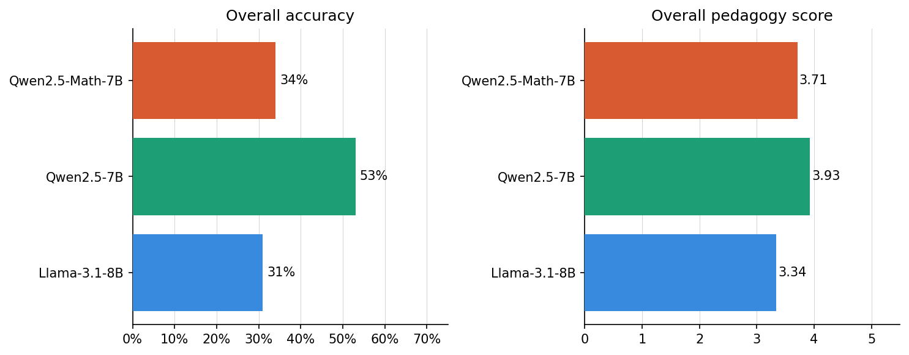

# Evaluating LLMs on Math Problems with an LLM-as-a-Judge Pipeline

Natural Language Processing and Recommender Systems course project, Free University of Bozen-Bolzano, 2026. Poster presented at LCL 2026, Bolzano 15-17 June 2026: [`docs/poster.pdf`](docs/poster.pdf) · Full report: [`nlp2026_macek_eskicioglu_report.pdf`](nlp2026_macek_eskicioglu_report.pdf)

We evaluate three open-weight LLMs on 100 mathematical questions sourced from the Mathematics Stack Exchange network. For evaluation we design a three-stage LLM-as-judge pipeline that separately assesses correctness and pedagogical quality of model answers. 

## Data and models

**Dataset: [StackMathQA](https://stackmathqa.github.io/)**
- Mathematical questions and answers sampled from the Stack Exchange network, ranging from enthusiast discussions to expert-level math problems.
- 100 questions sampled and labelled into 5 types: numeric, proof, yes/no, concept, open.
- Each question has multiple human-written answers, used as the reference.

**Solver models** (same prompt for all)
- `Meta-Llama-3.1-8B-Instruct`: general baseline
- `Qwen2.5-7B-Instruct`: strong general 7B model
- `Qwen2.5-Math-7B-Instruct`: math-specialised 7B model

**Judge model**
- `google/gemma-2-9b-it`: strong in summarisation and reasoning

## Evulation Pipeline

Using the judge model

1. **Stage 1 - Canonical answer extraction:** summarise the human Stack Exchange answers into a consensus answer.
2. **Stage 2 - Correctness evaluation:** compare the model's final conclusion with the canonical answer.
3. **Stage 3 - Pedagogical evaluation:** score clarity, structure, reasoning, pedagogical value and safety (1–5) of model explanation.

## Results

| Model | Accuracy | Pedagogical score (1–5) |
|---|---|---|
| Qwen2.5-7B-Instruct | **53%** | **3.93** |
| Qwen2.5-Math-7B-Instruct | 34% | 3.71 |
| Llama-3.1-8B-Instruct | 31% | 3.34 |

- Even the best model reaches only 53% accuracy; numeric and proof questions are hardest.
- Explanations stay clear even when the answer is wrong, while reasoning quality and pedagogical value drop sharply.
- Qwen2.5-7B beat its math-specialised sibling, likely partly due to a prompt-format mismatch (a hypothesis, not tested separately).

## Run it

Notebooks are listed in run order:
`multi_model_eval` →`stackmathqa_answers_extract` → `ANNOTATION` →  `judge_evaluation_STAGE1` → `judge-evaluation_pipelineSTAGE2-3`

**Note**: 
Log in to Hugging Face (`huggingface-cli login`). Llama 3.1 and Gemma 2 are gated, so accept their licences first.

**Compute:** the model evaluation was run on the GPU computers in the AI-Lab classroom at the university, and the judge pipeline on Google Colab, to get GPU access.

## Limitations

- Only 100 questions from a single source, which may not represent all mathematical domains or difficulty levels.
- All evaluated models are small (7–8B parameters), so results may differ for larger models.
- The judge model was chosen under computational constraints and may introduce its own biases. 
- The pipeline is also sensitive to output formatting, which probably affects the Qwen2.5-Math-7B results.

## Team

Project by **Valentina Macek** and **Zeynep Eskicioğlu**. Together we designed the models evaluation; Valentina designed and implemented the judge pipeline; together we interpreted the results and wrote the report.
